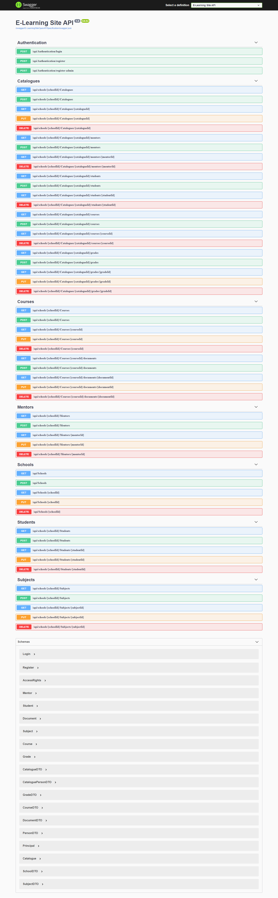

# E-learning App Back-end Project

This is part of the E-leaning Application from 4th Team Work week practice of Codecool's .NET C# Module.

For the Front-end project of the app, go to [Catch a Falling Star](https://github.com/TudorDan/CatchAFallingStar).

## Description

An application for the classical school education system. A school inspectorate that can have an online evidence of main data (teachers, courses, students, grades) from the group of affiliated schools.

## Technologies used

.NET Core 3.1, Swagger, SQL Server, Entity Framework Core, EntityFramework Identity, JWT Tokens

This project was created with [Visual Studio 2019](https://visualstudio.microsoft.com/vs/) ASP.NET Core Web API and Class library templates.

## Installation

In order for this project to run, you need an SQL Server localdb connection to your IDE.

After downloading the repo, in order to create the project's SQL Server database structure, open Package Manager Console, select "E-LearningSite.Data" as default project and run:

```c#
Update-Database
```

### Starting the solution

Set "E-LearningSite.Data" and "E-LearningSite.Domain" as dependencies for "E-LearningSite.API".

Set "E-LearningSite.Domain" as dependency for "E-LearningSite.Data".

Set "E-LearningSite.API" as StartUp Project.

## Implementation

Home page:

